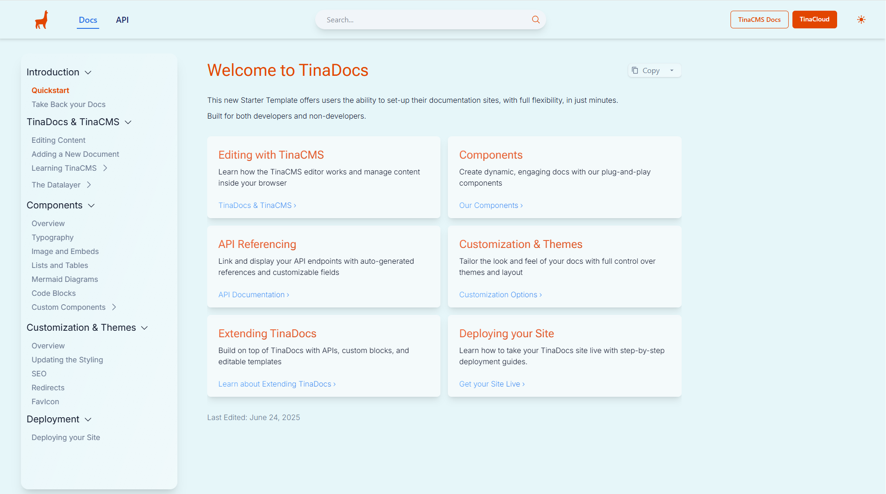

# 🚀 TinaDocs - Your Complete Documentation Solution

> **Modern documentation made simple and powerful**

TinaDocs is a complete documentation solution built with [Tina CMS](https://tina.io/) that combines developer-friendly tools with content creator accessibility.


**Figure: Landing Page of TinaDocs**

## ✨ Why Choose TinaDocs

### **Rich Feature Set**
- **🔍 Fast search** - Powered by Pagefind for instant content discovery
- **📊 API documentation** - Generate beautiful API docs from your OpenAPI specs
- **📑 Multi-tab interfaces** - Organize complex information with tabbed layouts
- **🎨 Custom theming** - Make your docs match your brand
- **✏️ Visual editing** - Content creators can edit directly through TinaCMS
- **📱 Responsive design** - Works great on all devices
- **⚡ Performance optimized** - Built with Next.js for fast load times

### **What Makes It Special**
- **Modern stack** - Clean, maintainable codebase
- **Developer-friendly** - Easy to customize and extend
- **Content creator-friendly** - Non-technical team members can contribute
- **SEO optimized** - Built-in best practices for search visibility

---

## 🚀 Quick Start with npx

The fastest way to get started with TinaDocs is using npx:

```bash
npx create-tina-app@latest my-docs --template tina-docs
```

This command will:
- Download and set up TinaDocs in a new directory called `my-docs`
- Prompt you to select your preferred theme during setup
- Configure the basic project structure
- Install all necessary dependencies

### **Available Themes**

When using npx, you can choose from these beautiful themes:

- **Default** - Clean black and white design
- **Tina** - TinaCMS-inspired theme with orange accents
- **Blossom** - Elegant pink/rose color scheme
- **Lake** - Professional blue color palette
- **Pine** - Natural green tones
- **Indigo** - Modern purple/indigo design

---

## 📖 How to Use TinaDocs

There are two ways you can use TinaDocs:

• **For developers** – as a launching point to develops a highly custom docs solution. TinaCMS is based on markdown. Use this code as a basis to [implement custom components](https://tina.io/docs/reference/types/rendering-markdown#linking-to-react-components) to be used in MDX to fit your use case. Follow the Getting Started guide below.

• **Quickest experience** – use as is and deploy in minutes via TinaCloud for a docs setup that you still hold all the keys and data for, and get to using right away.


> 💡 TinaCMS integrates tighly with GitHub, and has a powerful [editorial workflow](https://tina.io/docs/tina-cloud/editorial-workflow) based on GitHub's branch protection features.

## 🛠️ Getting Started

### **Step 1: Install Dependencies**

> 💡 We recommend `pnpm` for faster installs. [Learn why pnpm is great](https://www.ssw.com.au/rules/best-package-manager-for-node/) for Node.js projects.

```bash
pnpm install
```

### **Step 2: Start Development Server**

```bash
pnpm dev
```

Open [http://localhost:3000](http://localhost:3000) to see your docs in action.

---

## 🌐 Production Setup

### **Step 3: Set Up GitHub and TinaCloud**

1. **Add your docs to GitHub**: Push your local repository to GitHub if you haven't already  
2. **Create a TinaCloud account**: Sign up at [app.tina.io](https://app.tina.io)  
3. **Link your repository**: Connect your GitHub repository to TinaCloud through the dashboard  
Note: if you don’t see your repo in the list, click the button “Configure your TinaCloud permissions on GitHub” at the bottom of the page
4. **Sync Media**: In your TinaCloud project, click on Media and then "Sync Media". This will import your media files (like images) from your GitHub repository into Tina’s Media Manager so they’re available in the visual editor.

### **Step 4: Configure Environment**

1. Rename `.env.example` to `.env`
2. Add your Tina credentials:

```env
NEXT_PUBLIC_TINA_CLIENT_ID=<get this from app.tina.io>
TINA_TOKEN=<get this from app.tina.io>
NEXT_PUBLIC_TINA_BRANCH=<your content branch>
NEXT_PUBLIC_ENABLE_THEME_SELECTION=<display theme selector>
```

If you want to test `pnpm build` locally, you need to add:
```env
NEXT_PUBLIC_SITE_URL=http://localhost:3000
```

**Theme Preview Mode:**
To enable a theme selector in the UI for previewing all themes, add:
```env
NEXT_PUBLIC_ENABLE_THEME_SELECTION=true
```

> 💡 **Note:** The theme selector allows you to preview different themes in real-time, but these changes are temporary and won't persist when you open a new browser window/tab. To make a theme permanent, update the `Selected Them` field in your Settings through TinaCMS.

### **Step 5: Build for Production**

```bash
pnpm build
```

---

## 🚀 Deployment

### **Step 6: Deploy to Vercel** 

TinaDocs works great with Vercel. Check out our [deployment guide](https://tina.io/docs/tina-cloud/deployment-options/vercel) for detailed instructions.

---

## 🔍 Search Setup

TinaDocs includes fast search powered by [Pagefind](https://pagefind.app/), which indexes your content during the build process.

### **How to Build the Search Index**

To generate or update the search index, run:


```bash
pnpm build-local-pagefind
```
This command:

- Builds the project

- Generates the search index

- Saves the index files to `public/pagefind/`

The search index is automatically updated every time you run the build.

---

### **Custom Theming**

Want to create your own custom theme? TinaDocs includes a comprehensive theming system that allows you to create custom color schemes. See the [Custom Theming section](#-custom-theming) below for detailed instructions on how to create and implement your own themes.

---

## 🎨 Custom Theming

TinaDocs includes a comprehensive theming system that allows you to create custom color schemes. The theme system is built on CSS custom properties (variables) and supports both light and dark modes.

### **How Themes Work**

Themes in TinaDocs are implemented using CSS custom properties defined in `src/styles/global.css`. Each theme has:

- **Brand colors** (primary, secondary, tertiary) with hover states and gradients
- **Neutral colors** for backgrounds, text, and borders
- **Glass effects** for modern UI elements
- **Dark mode variants** for each theme

### **Theme Structure**

Each theme follows this pattern in `global.css`:

```css
/* LIGHT MODE */
.theme-your-theme {
  --brand-primary: #your-primary-color;
  --brand-primary-hover: #your-primary-hover;
  --brand-primary-light: #your-primary-light;
  --brand-primary-text: #your-primary-text;
  --brand-primary-contrast: #your-primary-contrast;
  
  --brand-primary-gradient-start: #your-gradient-start;
  --brand-primary-gradient-end: #your-gradient-end;
  
  /* ... more brand colors ... */
  
  --neutral-background: #your-background;
  --neutral-surface: #your-surface;
  --neutral-text: #your-text;
  --neutral-border: #your-border;
  
  --background-color: #your-page-background;
}

/* DARK MODE */
.theme-your-theme.dark {
  /* Dark mode variants of all the above colors */
}
```

### **Creating a Custom Theme**

To create a new custom theme, follow these steps:

#### **1. Add CSS Variables to `src/styles/global.css`**

Add your theme's CSS variables after the existing themes:

```css
/* YOUR CUSTOM THEME */
.theme-custom {
  --brand-primary: #your-primary-color;
  --brand-primary-hover: #your-primary-hover;
  --brand-primary-light: #your-primary-light;
  --brand-primary-text: #your-primary-text;
  --brand-primary-contrast: #your-primary-contrast;
  
  --brand-primary-gradient-start: #your-gradient-start;
  --brand-primary-gradient-end: #your-gradient-end;
  
  --brand-secondary: #your-secondary-color;
  --brand-secondary-hover: #your-secondary-hover;
  --brand-secondary-light: #your-secondary-light;
  --brand-secondary-text: #your-secondary-text;
  --brand-secondary-contrast: #your-secondary-contrast;
  
  --brand-secondary-gradient-start: #your-secondary-gradient-start;
  --brand-secondary-gradient-end: #your-secondary-gradient-end;
  
  --brand-tertiary: #your-tertiary-color;
  --brand-tertiary-hover: #your-tertiary-hover;
  --brand-tertiary-light: #your-tertiary-light;
  --brand-tertiary-text: #your-tertiary-text;
  --brand-tertiary-contrast: #your-tertiary-contrast;
  
  --brand-tertiary-gradient-start: #your-tertiary-gradient-start;
  --brand-tertiary-gradient-end: #your-tertiary-gradient-end;
  
  --glass-gradient-start: rgba(255, 255, 255, 0.1);
  --glass-gradient-end: rgba(255, 255, 255, 0.4);
  
  --neutral-background: #your-background;
  --neutral-background-secondary: #your-secondary-background;
  --neutral-surface: #your-surface;
  --neutral-text: #your-text;
  --neutral-text-secondary: #your-secondary-text;
  --neutral-border: #your-border;
  --neutral-border-subtle: #your-subtle-border;
  
  --background-color: #your-page-background;
}

.theme-custom.dark {
  /* Dark mode variants - invert or adjust colors for dark mode */
  --brand-primary: #your-dark-primary;
  --brand-primary-hover: #your-dark-primary-hover;
  /* ... continue with all other variables ... */
  
  --neutral-background: #your-dark-background;
  --neutral-surface: #your-dark-surface;
  --neutral-text: #your-dark-text;
  /* ... etc ... */
}
```

#### **2. Add Theme to TinaCMS Selector**

Update `tina/customFields/theme-selector.tsx` to include your new theme:

```typescript
const themes = [
  // ... existing themes ...
  {
    value: "custom",
    label: "Custom",
    description: "Your custom theme description",
    colors: {
      primary: "#your-primary-color",
      secondary: "#your-secondary-color", 
      accent: "#your-accent-color",
    },
  },
];
```

#### **3. Add Theme to UI Selector**

Update `src/components/ui/theme-selector.tsx` to include your theme in the themes array:

```typescript
const themes = ["default", "tina", "blossom", "lake", "pine", "indigo", "custom"];
```

#### **4. Apply Your Theme**

1. **Temporary preview**: Use the theme selector in the UI (if enabled)
2. **Permanent change**: Update the "Selected Theme" field in TinaCMS Settings

### **Color Guidelines**

When creating custom themes, consider these guidelines:

- **Primary colors**: Use for main actions, links, and important UI elements
- **Secondary colors**: Use for supporting elements and secondary actions  
- **Tertiary colors**: Use for accents and highlights
- **Neutral colors**: Ensure good contrast ratios for accessibility
- **Dark mode**: Test your theme in both light and dark modes

### **Theme Testing**

To test your custom theme:

1. Enable theme preview: `NEXT_PUBLIC_ENABLE_THEME_SELECTION=true`
2. Use the theme selector in the bottom-right corner
3. Test in both light and dark modes
4. Verify accessibility with sufficient contrast ratios

### **Theme Examples**

The existing themes demonstrate different approaches:

- **Default**: Minimalist monochrome design
- **Tina**: Brand-focused with orange and blue
- **Blossom**: Warm, elegant pink tones
- **Lake**: Professional blue palette
- **Pine**: Natural, organic green theme
- **Indigo**: Modern purple/violet design

Each theme includes comprehensive color variations for different UI states and accessibility considerations.

---

## 🛠️ Utility Scripts

TinaDocs includes helpful utility scripts to manage your documentation project:

### **Documentation Reset**

Completely reset your documentation structure to start fresh:

```bash
pnpm run cleanup
```

**What it does:**
- ✅ Removes all directories within `content/docs/` (preserves only `index.mdx`)
- ✅ Removes all API schema files in `content/apiSchema/`
- ✅ Removes docs-assets and landing-assets image directories
- ✅ Completely removes the API tab from navigation
- ✅ Clears Next.js cache (`.next` folder) to prevent stale page references
- ✅ Provides a clean documentation slate for new content
- ✅ Validates project structure before running
- ✅ **Requires interactive confirmation** - asks for explicit "yes" to proceed

> **🚨 CRITICAL WARNING:** 
> 
> **This command PERMANENTLY DELETES all documentation content.**
> 
> - ❌ **If you've already made changes**, running cleanup will DELETE your work
> - ✅ **Run cleanup FIRST** if you want a clean slate, then make your changes
> - ✅ **Commit your changes to git** before running cleanup if you want to preserve them
> 
> **This action cannot be undone unless you have committed your changes to version control.**

> **⚠️ Important:** After running cleanup, you must restart your development server with `pnpm dev` to ensure Next.js rebuilds the site without cached references to deleted pages.

For detailed information about available scripts, see [`scripts/README.md`](./scripts/README.md).

---

## 📚 Learn More

- [Tina Documentation](https://tina.io/docs) - Explore Tina's full capabilities
- [Getting Started Guide](https://tina.io/docs/setup-overview/) - Quick setup walkthrough
- [GitHub Repository](https://github.com/tinacms/tinacms) - Contribute or report issues

---

### API Documentation

TinaDocs provides comprehensive API documentation capabilities powered by OpenAPI specifications. Generate beautiful, interactive API documentation directly from your OpenAPI/Swagger JSON files.

#### **Supported Features**

**🔄 Dynamic Content Management**
- **Upload OpenAPI specs** - Import your API specifications through TinaCMS
- **Auto-generated navigation** - Create menu structures based on API tags and endpoints
- **Bulk page generation** - Generate entire documentation sections from your spec
- **Real-time updates** - Update documentation when your API spec changes

#### **What's Not Supported**

Currently, TinaDocs does not support:
- **Header configuration APIs** - Custom header management endpoints
- **WebSocket APIs** - Real-time communication endpoints
- **GraphQL schemas** - GraphQL introspection schemas (use REST API docs instead)

#### **Getting Started with API Docs**

1. **Upload your OpenAPI spec** through the API Schema collection in TinaCMS
2. **Create API reference pages** using the API Reference component
3. **Generate navigation structure** with the "Group of API References" template
4. **Customize the display** by selecting specific endpoints and tags

For detailed instructions, see the [API Documentation Guide](content/docs/api-documentation/overview.mdx) and [OpenAPI Spec Documentation](content/docs/tinadocs-features/openapi-spec-docs.mdx).

---

**Ready to improve your documentation?** Give TinaDocs a try!
