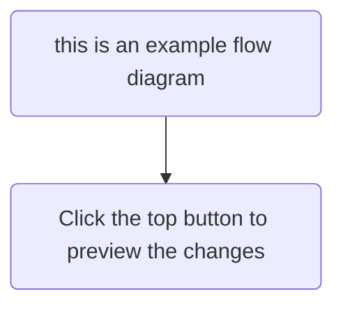
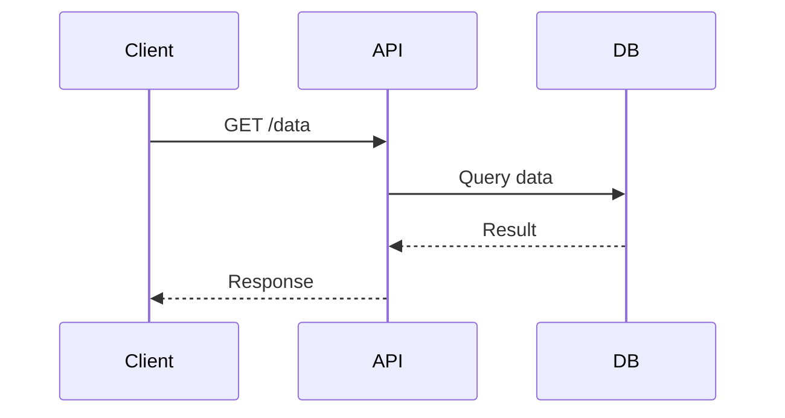
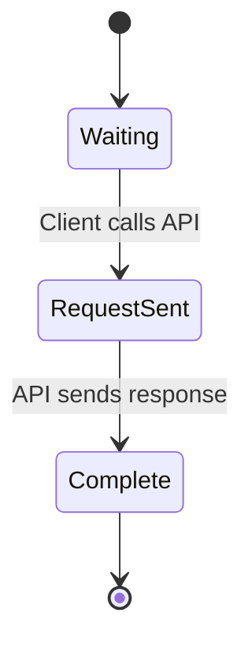
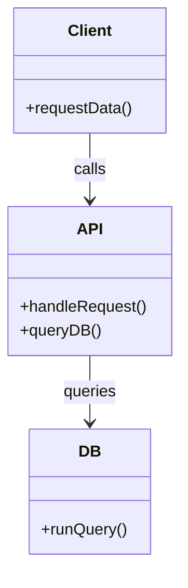
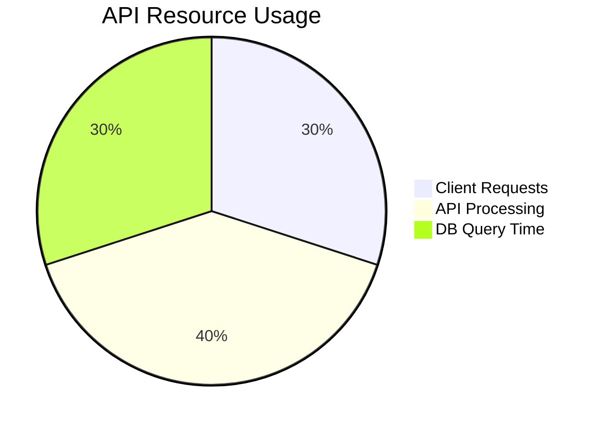

Several components have been implemented to help out with software documentation.

## Code Blocks

For multiline code samples, use triple backticks. You can also specify which language is used in the fenced code block for associated code highlighting.

```javascript
js function greet(name) {
  return `Hello, ${name}!`
}
```

### Syntax Highlighting

TinaDocs uses [Shiki](https://shiki.style/) to power code block rendering, because of this you are able to also use [Shiki's Transformer Notation](https://shiki.style/guide/transformers) for special highlighting.

```javascript
console.log('This is a highlighted block') // [!code highlight]

It uses "[!code highlight]" in a comment after the code
```

### Diff Highlighting

```javascript
console.log('This is a negative diff') // [!code --]
console.log('This is a positive diff') // [!code ++]

It uses "[!code --]" or "[!code ++]" in a comment after the code
```

### Focused Highlighting

```javascript
console.log('Junk Code');
console.log('Focused Code'); // [!code focus]
console.log('More hidden code');

It uses "[!code focus]" in a comment after the code
```

## Tabbed Code Blocks

Tabbed code blocks let you present multiple language variants or configurations side-by-side—ideal for showing equivalent code in JavaScript, TypeScript, Bash, or specific queries and responses.

This improves readability and UX for polyglot dev environments.

<codeTabs
  tabs={[
    {
      name: "cURL",
      content: "curl�-�X�GET�https://jsonplaceholder.typicode.com/posts/1",
      language: "shell"
    },
    {
      name: "Response",
      content:
        '{\n��"userId":�1,\n��"id":�1,\n��"title":�"sunt�aut�facere�repellat�provident�occaecati�excepturi�optio�reprehenderit",\n��"body":�"quia�et�suscipit\\nsuscipit�recusandae�consequuntur�expedita�et�cum..."\n}',
      language: "json"
    }
  ]}
  initialSelectedIndex={1}
/>

<codeTabs
  tabs={[
    {
      name: "React",
      content:
        "import�React,�{�useState�}�from�'react';\n\nfunction�Counter()�{\n��const�[count,�setCount]�=�useState(0);\n\n��return�(\n����<div>\n������<p>Count:�{count}</p>\n������<button�onClick={()�=>�setCount(count�+�1)}>Increment</button>\n����</div>\n��);\n}\n\nexport�default�Counter;",
      language: "javascript"
    },
    {
      name: "Vue",
      content:
        "<template>\n��<div>\n����<p>Count:�{{�count�}}</p>\n����<button�@click=\"increment\">Increment</button>\n��</div>\n</template�>\n\n<script�setup>\n��import�{ref}�from�'vue';\n\n��const�count�=�ref(0);\n��const�increment�=�()�=>�count.value++;\n</script>",
      language: "javascript"
    },
    {
      name: "Angular",
      content:
        "import�{�Component�}�from�'@angular/core';\n\n@Component({\n��selector:�'app-counter',\n��template:�`\n����<div>\n������<p>Count:�{{�count�}}</p>\n������<button�(click)=\"increment()\">Increment</button>\n����</div>\n��`\n})\nexport�class�CounterComponent�{\n��count�=�0;\n��increment()�{\n����this.count++;\n��}\n}",
      language: "javascript"
    }
  ]}
  initialSelectedIndex={2}
/>

## Recipe Block

Perfect for tutorials, API documentation, or any scenario where you want to guide users through code examples with numbered steps corresponding to specific lines of code.

<recipe
  code="import�React,�{�useState�}�from�'react';

  function�Counter()�{
  ��const�[count,�setCount]�=�useState(0);

  ��return�(
  ����<div>
  ������<p>Count:�{count}</p>
  ������<button�onClick={()�=>�setCount(count�+�1)}>Increment</button>
  ����</div>
  ��);
  }

  export�default�Counter;"
  title=""
  description=""
  instruction={[
    {
      itemDescription: "Import the useState hook from React",
      header: "Imports",
      codeLineStart: 1,
      codeLineEnd: 1
    },
    {
      itemDescription: "Define a functional component named Counter",
      header: "Define Component",
      codeLineStart: 3,
      codeLineEnd: 3
    },
    {
      header: "Define State",
      itemDescription:
        "Declare state variable `count` with initial value 0, `setCount` is the updater function",
      codeLineStart: 4,
      codeLineEnd: 4
    },
    {
      itemDescription: "Return JSX to render the UI",
      header: "Render Logic",
      codeLineStart: 7,
      codeLineEnd: 10
    }
  ]}
/>

## API Route Block

Takes data directly from an OpenAPI spec to populate this component with schema, responses and examples.

<apiReference schemaFile="Swagger-Petstore.json|GET:/user/login" />

## Directory

To convey code architecture or organisation conventions, showing users folder structures helps convey structural ideas that can be tricky to explain textually.

The editing experience is smooth with a tailored drag-and-drop interface.

<fileStructure
  fileStructure={[
    { id: "zm0xmlefo", name: "Folder A", type: "folder", parentId: null },
    { id: "d7bw8ns62", name: "File A.txt", type: "file", parentId: "zm0xmlefo" },
    {
      id: "xaiajws95",
      name: "Subfolder A",
      type: "folder",
      parentId: "zm0xmlefo"
    },
    { id: "xv64qw84k", name: "Folder B", type: "folder", parentId: null },
    { id: "beqrd40u0", name: "Subfolder", type: "folder", parentId: "xv64qw84k" },
    { id: "yijaqtwhg", name: "File B.txt", type: "file", parentId: "beqrd40u0" },
    { id: "hfv48qb0z", name: "Home Route File.txt", type: "file", parentId: null }
  ]}
  caption="An example file structure"
/>

## Mermaid

TinaDocs supports [Mermaid.js](https://mermaid.js.org/), to define and render diagrams directly inside Markdown content.

This lets you to add flowcharts, sequence diagrams, Gantt charts, and more.

The diagram shares the code block node in the editor, but lets you preview what the diagram will look like.

<Callout
  body={<>
    Mermaid Rendering is **client-side** only, so server-side previews wont show diagrams
  </>}
  variant="warning"
/>

### Flowcharts



### Sequence Diagrams



### State Diagram



### Class Diagram



### Pie Chart


